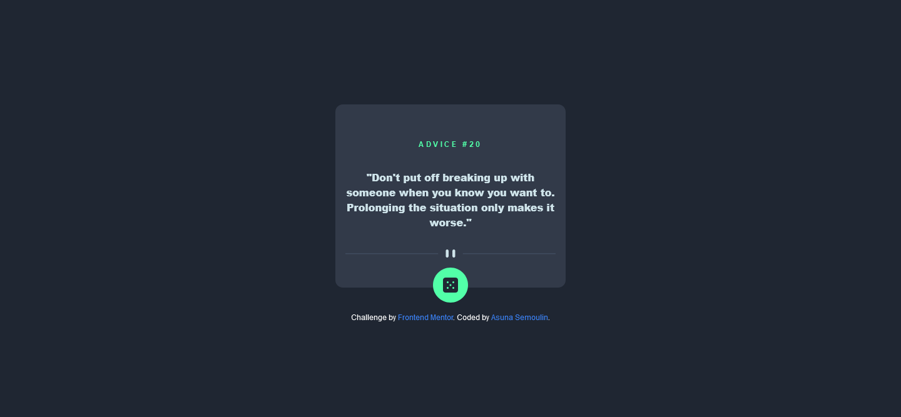
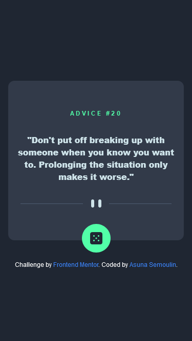

# Frontend Mentor - Advice generator app solution

This is a solution to the [Advice generator app challenge on Frontend Mentor](https://www.frontendmentor.io/challenges/advice-generator-app-QdUG-13db). Frontend Mentor challenges help you improve your coding skills by building realistic projects.

## Table of contents

- [Overview](#overview)
  - [The challenge](#the-challenge)
  - [Screenshot](#screenshot)
  - [Links](#links)
- [My process](#my-process)
  - [Built with](#built-with)
  - [What I learned](#what-i-learned)
  - [Useful resources](#useful-resources)
- [Author](#author)

## Overview

### The challenge

Users should be able to:

- View the optimal layout for the app depending on their device's screen size
- See hover states for all interactive elements on the page
- Generate a new piece of advice by clicking the dice icon

### Screenshot




### Links

- Solution URL: [https://www.frontendmentor.io/solutions/api-calls-with-fetch-api-kCKhOpXzBS](https://www.frontendmentor.io/solutions/api-calls-with-fetch-api-kCKhOpXzBS)
- Live Site URL: [https://asunamarie.github.io/advice-generator-app-main/](https://asunamarie.github.io/advice-generator-app-main/)

## My process

### Built with

- Semantic HTML5 markup
- Flexbox
- Mobile-first workflow
- [Tailwind CSS](https://tailwindcss.com/) - CSS framework

### What I learned

I learned about fetch.
A function that is useful for doing API calls.
```js
const getAdvice = async () => {
    const response = await fetch('https://api.adviceslip.com/advice?t=' + Math.random())
    const advice = await response.json()
    
    return advice
}
```

### Useful resources

- [Using the Fetch API](https://developer.mozilla.org/en-US/docs/Web/API/Fetch_API/Using_Fetch) - It helped me use the Fetch API to do API calls.

## Author

- Frontend Mentor - [@AsunaMarie](https://www.frontendmentor.io/profile/AsunaMarie)
